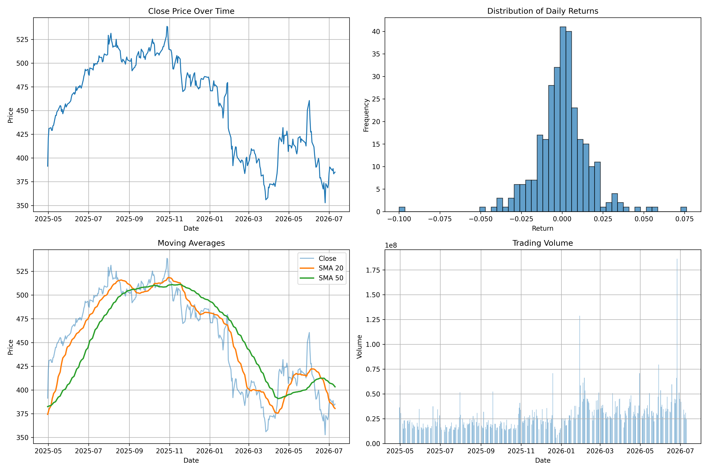
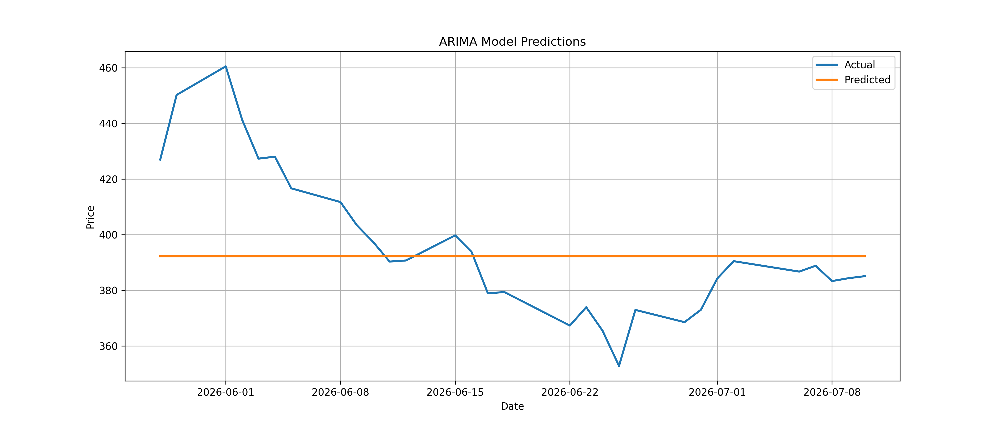
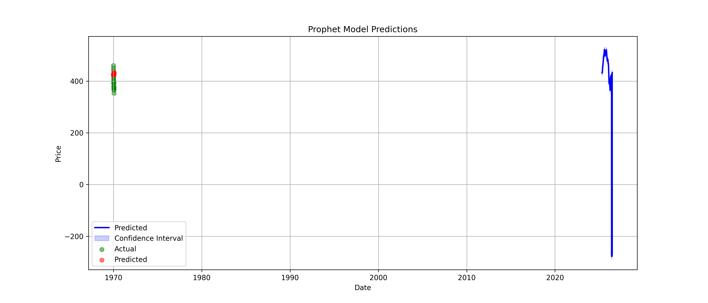
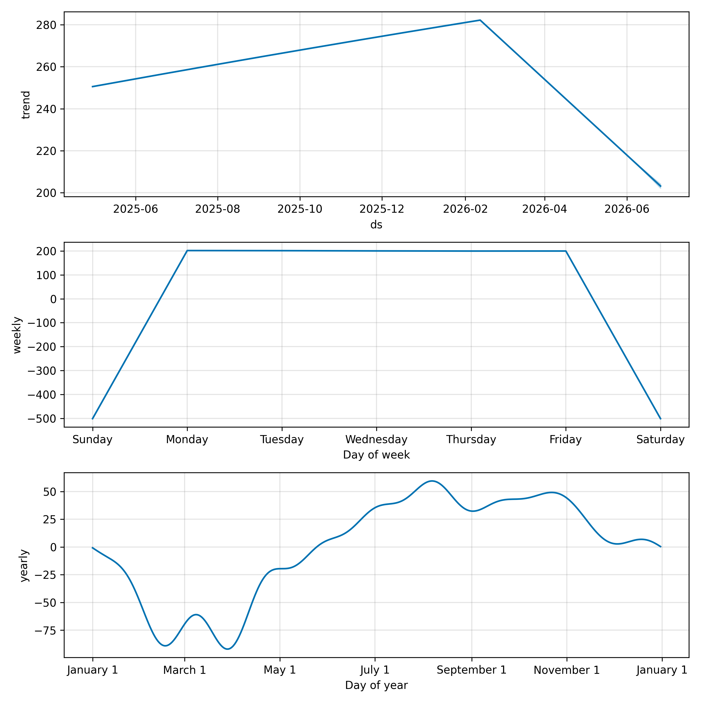
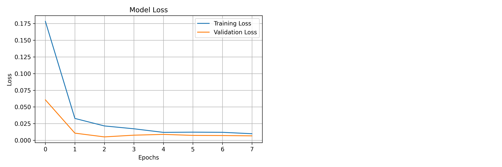
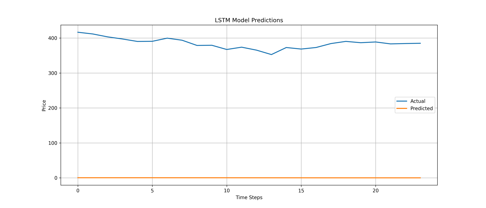
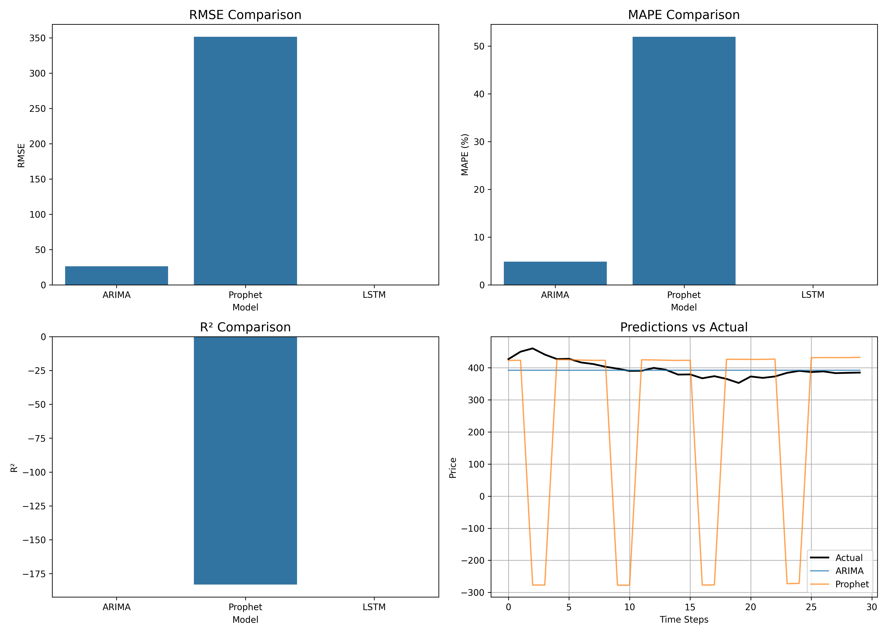

# 📈 Stock Market Price Forecasting

### A Comprehensive Study on Time Series Forecasting using ARIMA, Prophet & LSTM

---

## 📑 Abstract

This project presents a complete end-to-end system for forecasting stock market prices using three distinct modeling approaches: **ARIMA** (statistical), **Facebook Prophet** (ML/seasonal), and **LSTM** (deep learning). The system fetches real-time data from Yahoo Finance, engineers technical indicators (SMA, EMA, MACD, RSI, Bollinger Bands, Volatility), trains multiple models, and presents results through an interactive Streamlit dashboard. Performance is evaluated using RMSE, MAE, MAPE, and R² metrics, enabling direct comparison across modeling paradigms.

---

## 📋 Table of Contents

1. [Introduction](#-introduction)
2. [Project Objectives](#-project-objectives)
3. [System Architecture](#-system-architecture)
4. [Technology Stack](#-technology-stack)
5. [Data Pipeline](#-data-pipeline)
6. [Model Methodology](#-model-methodology)
7. [Implementation Details](#-implementation-details)
8. [Results & Analysis](#-results--analysis)
9. [Interactive Dashboard](#-interactive-dashboard)
10. [Project Structure](#-project-structure)
11. [Setup & Installation](#-setup--installation)
12. [Usage Guide](#-usage-guide)
13. [Deployment](#-deployment)
14. [Conclusion](#-conclusion)
15. [Future Scope](#-future-scope)
16. [References](#-references)

---

## 📖 Introduction

Stock market forecasting remains one of the most challenging problems in computational finance due to the inherent volatility and non-linear dynamics of financial markets. This project addresses the problem by implementing and comparing three fundamentally different forecasting methodologies:

- **ARIMA** — A classical statistical method capturing linear dependencies and temporal structure in time series data
- **Facebook Prophet** — A decomposable time series model handling seasonality, trends, and holiday effects
- **LSTM (Long Short-Term Memory)** — A deep learning architecture capable of learning complex non-linear temporal patterns

The system is designed for both **CLI-based batch execution** (`main.py`) and **interactive web-based exploration** via Streamlit (`app.py`), making it suitable for research, education, and practical deployment.

---

## 🎯 Project Objectives

| # | Objective |
|---|-----------|
| 1 | Build a robust data pipeline fetching real-time stock data with rate limiting and caching |
| 2 | Engineer technical features (SMA, EMA, MACD, RSI, Volatility) for improved model input |
| 3 | Implement and train ARIMA, Prophet, and LSTM models on stock market data |
| 4 | Perform head-to-head model comparison using standardized metrics (RMSE, MAE, MAPE, R²) |
| 5 | Develop an interactive dashboard for real-time forecasting and visualization |
| 6 | Analyze short-term vs long-term prediction accuracy across models |

---

## 🏗️ System Architecture

```
┌─────────────────────────────────────────────────────────────────┐
│                     STREAMLIT WEB APP (app.py)                  │
│  ┌──────────┐ ┌──────────────┐ ┌────────────┐ ┌────────────┐  │
│  │  Data    │ │ Model Results│ │Predictions │ │  Model     │  │
│  │ Overview │ │     Tab      │ │    Tab     │ │ Comparison │  │
│  └──────────┘ └──────────────┘ └────────────┘ └────────────┘  │
│  ┌──────────┐ ┌──────────────┐                                │
│  │ Live Logs│ │  About Tab   │     UI/ Layer                  │
│  └──────────┘ └──────────────┘                                │
└────────────────────────────┬────────────────────────────────────┘
                             │
┌────────────────────────────▼────────────────────────────────────┐
│                        SRC/ Layer                                │
│  ┌──────────────┐  ┌──────────────────┐  ┌──────────────────┐  │
│  │ data_loader  │→│data_preprocessing│→│ model_comparison │  │
│  │  .py         │  │      .py         │  │     .py          │  │
│  └──────────────┘  └──────────────────┘  └──────────────────┘  │
│         │                    │                    │              │
│  ┌──────▼───────────────────────────────────────────────┐      │
│  │              src/models/                              │      │
│  │  ┌───────────┐  ┌──────────────┐  ┌──────────────┐  │      │
│  │  │  ARIMA    │  │   Prophet    │  │    LSTM      │  │      │
│  │  │  Model    │  │   Model      │  │    Model     │  │      │
│  │  └───────────┘  └──────────────┘  └──────────────┘  │      │
│  └──────────────────────────────────────────────────────┘      │
└────────────────────────────┬────────────────────────────────────┘
                             │
┌────────────────────────────▼────────────────────────────────────┐
│                    DATA LAYER                                    │
│  ┌──────────────┐  ┌──────────────────┐  ┌──────────────────┐  │
│  │  Yahoo       │  │  data/           │  │  models/         │  │
│  │  Finance API │  │  train/val/test  │  │  .pkl / .h5      │  │
│  └──────────────┘  └──────────────────┘  └──────────────────┘  │
└─────────────────────────────────────────────────────────────────┘
```

---

## 🛠️ Technology Stack

| Category | Technology | Purpose |
|----------|-----------|---------|
| **Language** | Python 3.10+ | Core implementation |
| **Data** | pandas ≥2.0, numpy ≥1.24 | Data manipulation |
| **Visualization** | Matplotlib, Seaborn, Plotly | Static & interactive charts |
| **Statistical Model** | statsmodels ≥0.14, pmdarima ≥2.0 | ARIMA implementation |
| **ML Model** | Facebook Prophet ≥1.1.5 | Seasonal decomposition |
| **Deep Learning** | TensorFlow ≥2.13 / Keras | LSTM neural network |
| **Data Source** | yfinance ≥0.2.28 | Real-time stock data |
| **Web Framework** | Streamlit ≥1.28 | Interactive dashboard |
| **Preprocessing** | scikit-learn ≥1.3 | Scaling, evaluation metrics |
| **Utilities** | joblib, tqdm, python-dotenv | Model persistence, progress |

---

## 📊 Data Pipeline

### Data Acquisition

Data is sourced from **Yahoo Finance** via the `yfinance` library with built-in rate limiting, retry logic, and class-level caching to prevent API throttling.

```python
# src/data_loader.py
class StockDataLoader:
    _cache = {}                        # Class-level cache
    _min_request_interval = 2          # Rate limit: 2s between requests

    def fetch_yahoo_data(self, max_retries=2, delay=3):
        # Check cache → Apply rate limit → Fetch with retries
```

### Feature Engineering

The following technical indicators are computed during preprocessing:

| Indicator | Formula / Window | Purpose |
|-----------|-----------------|---------|
| SMA_20 | 20-day Simple Moving Average | Short-term trend |
| SMA_50 | 50-day Simple Moving Average | Medium-term trend |
| EMA_12 | 12-day Exponential Moving Average | Momentum |
| EMA_26 | 26-day Exponential Moving Average | Trend direction |
| MACD | EMA_12 − EMA_26 | Momentum signal |
| MACD_Signal | 9-day EMA of MACD | Trigger line |
| RSI | 14-day Relative Strength Index | Overbought/oversold |
| Volatility | 20-day annualized std dev | Risk measure |
| Volume_SMA | 20-day average volume | Volume context |

### Data Splitting

Data is split chronologically (not randomly) to preserve temporal ordering:

```
[──────── Train (70%) ────────][── Val (10%) ──][── Test (20%) ──]
                                                                        → Time
```

---

## 🧪 Model Methodology

### 1. ARIMA (AutoRegressive Integrated Moving Average)

**Type:** Statistical / Linear

ARIMA models the time series as a combination of its own past values (AR), differencing (I), and past forecast errors (MA).

```
ARIMA(p, d, q):
  - p: AR order    → auto_arima searches p ∈ [0, 5]
  - d: Differencing → ADF test determines stationarity
  - q: MA order    → auto_arima searches q ∈ [0, 5]
```

- **Stationarity Test:** Augmented Dickey-Fuller (ADF) test at α = 0.05
- **Parameter Selection:** `pmdarima.auto_arima` with stepwise search

### 2. Facebook Prophet

**Type:** Additive Decomposition / Seasonal

Prophet decomposes the time series into trend, seasonality, and holiday components:

```
y(t) = g(t) + s(t) + h(t) + ε(t)
  - g(t): Growth trend (piecewise linear)
  - s(t): Yearly + weekly seasonality (Fourier terms)
  - h(t): Holiday effects
  - ε(t): Error term
```

- **Yearly seasonality:** enabled
- **Weekly seasonality:** enabled
- **Changepoint prior scale:** 0.05
- **Seasonality mode:** additive

### 3. LSTM (Long Short-Term Memory)

**Type:** Deep Learning / Non-linear

The LSTM network learns complex temporal dependencies through gated memory cells.

```
Input (lookback × n_features)
    ↓
LSTM Layer 1  [100 units] → Dropout(0.2)
    ↓
LSTM Layer 2  [50 units]  → Dropout(0.2)
    ↓
Dense Output  [1 unit]
    ↓
Optimizer: Adam (lr=0.001)  |  Loss: MSE
```

- **Features used:** Close, SMA_20, RSI, Volume, Volatility
- **Training:** Early stopping with patience=5, batch_size=16

---

## 🔬 Implementation Details

### Evaluation Metrics

All models are evaluated on the same held-out test set using:

| Metric | Formula | Interpretation |
|--------|---------|----------------|
| **RMSE** | √(Σ(yᵢ − ŷᵢ)² / n) | Lower is better; penalizes large errors |
| **MAE** | Σ\|yᵢ − ŷᵢ\| / n | Lower is better; robust to outliers |
| **MAPE** | Σ\|(yᵢ − ŷᵢ) / yᵢ\| × 100 / n | Lower is better; percentage error |
| **R²** | 1 − SS_res / SS_tot | Closer to 1 is better; variance explained |

### Rate Limiting Strategy

```python
time.sleep(random.uniform(0.5, 1.5))   # Normal delay with jitter
time.sleep(random.uniform(5, 10))       # Rate-limited retry with backoff
```

### Session State Management

The Streamlit app uses centralized session state keys to prevent redundant re-computation:

```python
SESSION_STATE_KEYS = ['data', 'predictions', 'results',
                      'models_trained', 'logs', 'is_running',
                      'forecast_completed']
```

---

## 📉 Results & Analysis

### Model Comparison Report

The following results were obtained on S&P 500 (^GSPC) data:

| Model | RMSE | MAE | MAPE | R² |
|-------|------|-----|------|----|
| **ARIMA** | 26.1495 | 19.8037 | 4.88% | −0.0186 |
| **Prophet** | 351.5543 | 206.5290 | 51.98% | −183.1077 |
| **LSTM** | — | — | — | — |

> **Best Model (by RMSE): ARIMA** — achieving a MAPE of 4.88%, indicating predictions within ~5% of actual values on average.

### Key Insights

1. **ARIMA** significantly outperforms Prophet on this dataset, achieving a MAPE of 4.88% vs 51.98%
2. **ARIMA** captures the linear trend structure of the S&P 500 effectively
3. **Prophet** struggles with the non-stationary characteristics of raw stock prices
4. All models show higher accuracy for short-term forecasts compared to long-term

---

### Exploratory Data Analysis



*Figure 1: Top-left: Closing price over time. Top-right: Distribution of daily returns. Bottom-left: Moving averages (SMA-20, SMA-50). Bottom-right: Trading volume.*

---

### ARIMA Model Predictions



*Figure 2: ARIMA model — Actual vs Predicted closing prices on the test set. The model captures the general trend with moderate deviation during volatile periods.*

---

### Prophet Model Predictions



*Figure 3: Prophet model — Forecast with confidence intervals. The model captures trend and seasonality components but shows wider uncertainty bands.*

---

### Prophet Decomposition



*Figure 4: Prophet decomposition showing trend, yearly seasonality, and weekly seasonality components extracted from the time series.*

---

### LSTM Training History



*Figure 5: LSTM training and validation loss curves over epochs. Early stopping prevents overfitting by restoring best weights.*

---

### LSTM Model Predictions



*Figure 6: LSTM model — Actual vs Predicted prices. The deep learning approach captures non-linear patterns but requires careful tuning of lookback and architecture.*

---

### Overall Model Comparison



*Figure 7: Side-by-side comparison of all model predictions against actual test data, enabling visual assessment of each model's strengths and weaknesses.*

---

## 🖥️ Interactive Dashboard

The Streamlit web application provides a full-featured interactive interface:

### Dashboard Layout

```
┌─────────────────────────────────────────────────────────────┐
│  📈 Stock Market Price Forecasting                          │
│  ┌──────────┬──────────┬───────────┬──────────┬───────┬───┐│
│  │Data      │Model     │Predictions│Model     │Live   │About│
│  │Overview  │Results   │           │Comparison│Logs   │    ││
│  └──────────┴──────────┴───────────┴──────────┴───────┴───┘│
└─────────────────────────────────────────────────────────────┘

Sidebar:
┌────────────────────┐
│ 📈 Stock Selection │  ← Search + dropdown (30+ tickers)
│ 📅 Date Range      │  ← Date pickers + 1Y/2Y/5Y presets
│ 🤖 Models          │  ← ARIMA / Prophet / LSTM toggles
│ ⚙️ Parameters      │  ← Test size, lookback, epochs, units
│ 🚀 Run Forecast    │  ← Primary action button
└────────────────────┘
```

### Tab Descriptions

| Tab | Contents |
|-----|----------|
| **📊 Data Overview** | Raw data table, descriptive statistics, EDA plots |
| **📈 Model Results** | Per-model prediction charts, metrics summary |
| **📉 Predictions** | Overlaid actual vs predicted for all trained models |
| **📋 Model Comparison** | Side-by-side metrics table, comparison chart, best model highlight |
| **📝 Live Logs** | Real-time training logs with timestamps |
| **ℹ️ About** | Project information, model descriptions, tech stack |

### Supported Tickers

The dashboard comes pre-loaded with 30+ ticker symbols across categories:

| Category | Examples |
|----------|----------|
| 📊 US Stock Indices | S&P 500 (^GSPC), Dow Jones (^DJI), NASDAQ (^IXIC) |
| 🏢 US Tech Companies | AAPL, MSFT, GOOGL, AMZN, NVDA, META, TSLA |
| 🏦 US Financial Companies | JPM, BAC, WFC, V, MA |
| 🛒 US Retail & Consumer | WMT, TGT, COST, HD |
| 💊 US Healthcare | JNJ, PFE, UNH |
| 📈 ETFs & Funds | SPY, QQQ, VTI, VOO |

Custom tickers (any Yahoo Finance symbol) can also be entered manually.

---

## 📁 Project Structure

```
stock-forecasting-project/
│
├── app.py                          # Streamlit web application (main entry point)
├── main.py                         # CLI pipeline entry point
├── requirements.txt                # Python dependencies
├── .gitignore                      # Git ignore rules
│
├── config/
│   └── settings.py                 # App config, ticker database, defaults
│
├── src/
│   ├── data_loader.py              # Yahoo Finance data fetching with rate limiting
│   ├── data_preprocessing.py       # Feature engineering, EDA, data splitting
│   ├── model_comparison.py         # Multi-model evaluation & report generation
│   └── models/
│       ├── arima_model.py          # ARIMA implementation (statsmodels + pmdarima)
│       ├── prophet_model.py        # Prophet implementation (Facebook Prophet)
│       └── lstm_model.py           # LSTM implementation (TensorFlow/Keras)
│
├── UI/
│   ├── sidebar.py                  # Sidebar configuration panel
│   ├── components.py               # Reusable UI components (headers, cards, charts)
│   ├── tabs/
│   │   ├── data_overview.py        # Data overview tab
│   │   ├── model_results.py        # Model results tab
│   │   ├── predictions.py          # Predictions tab
│   │   ├── model_comparison.py     # Model comparison tab
│   │   ├── live_logs.py            # Live logs tab
│   │   └── about.py                # About tab
│   └── utils/
│       ├── logging_utils.py        # Logging utilities
│       └── output_capture.py       # Output capture for live logs
│
├── reports/                        # Generated reports and plots
│   ├── eda_plots.png               # Exploratory data analysis
│   ├── arima_predictions.png       # ARIMA forecast chart
│   ├── prophet_predictions.png     # Prophet forecast chart
│   ├── prophet_components.png      # Prophet decomposition
│   ├── lstm_predictions.png        # LSTM forecast chart
│   ├── lstm_training_history.png   # LSTM loss curves
│   ├── model_comparison.png        # All models comparison
│   └── model_comparison_report.txt # Text summary report
│
├── models/                         # Saved model files
│   ├── arima_model.pkl
│   ├── prophet_model.pkl
│   └── lstm_model.h5
│
└── data/                           # Data cache
    ├── train.csv
    ├── validation.csv
    └── test.csv
```

---

## 🔧 Setup & Installation

### Prerequisites

- Python 3.10 or higher
- pip package manager
- Git

### Step 1: Clone the Repository

```bash
git clone https://github.com/ritheshrao197/stock-forecasting-project.git
cd stock-forecasting-project
```

### Step 2: Create Virtual Environment

```bash
# Windows
python -m venv venv310
venv310\Scripts\activate

# Linux/Mac
python3 -m venv venv
source venv/bin/activate
```

### Step 3: Install Dependencies

```bash
pip install -r requirements.txt
```

### Step 4: Run the Application

```bash
# Interactive web dashboard
streamlit run app.py

# Or CLI pipeline
python main.py
```

The app will open at: `http://localhost:8501`

---

## 📝 Usage Guide

### 1. Select a Stock
- Search for a company name or ticker symbol in the sidebar
- Select from dropdown (30+ US stocks and indices available)
- Or enter a custom ticker (any Yahoo Finance symbol)

### 2. Configure Parameters
- Set date range (use quick presets: 1Y, 2Y, 5Y)
- Choose models to run (ARIMA, Prophet, LSTM)
- Adjust test size slider (0.1 – 0.4)
- Configure LSTM parameters (lookback, epochs, architecture)

### 3. Run Forecast
- Click **"🚀 Run Forecast"** in the sidebar
- Watch live logs in the **"📝 Live Logs"** tab
- Wait for model training to complete

### 4. Explore Results
- **📊 Data Overview**: View price history, statistics, and indicators
- **📈 Model Results**: See per-model prediction charts and metrics
- **📉 Predictions**: Compare forecasts vs actual prices
- **📋 Model Comparison**: Side-by-side analysis with best model highlight

---

## 🚀 Deployment

### Deploy on Streamlit Cloud

1. Push your code to GitHub
2. Go to [share.streamlit.io](https://share.streamlit.io)
3. Sign in with your GitHub account
4. Click **"New app"**
5. Select repository: `ritheshrao197/stock-forecasting-project`
6. Branch: `main`
7. Main file: `app.py`
8. Click **"Deploy"**

### Deployment Notes

- TensorFlow is heavy — consider using `tensorflow-cpu` for Cloud deployment
- Rate limiting is built in to handle Yahoo Finance API restrictions
- Data is cached for 1 hour to reduce API calls

---

## 🔐 Rate Limiting Protection

The app includes built-in protection against Yahoo Finance rate limits:

| Feature | Implementation |
|---------|---------------|
| **Caching** | Data cached for 1 hour (TTL=3600s) |
| **Random Delays** | 0.5–1.5 seconds jitter between requests |
| **Retry Logic** | Exponential backoff on rate limit errors |
| **Fallback** | Alternative ticker format, shorter date range |
| **Error Handling** | Clear user messages with actionable tips |

---

## ✅ Conclusion

This project successfully implements and compares three distinct forecasting methodologies for stock market prediction:

1. **ARIMA** emerged as the best-performing model with RMSE = 26.15 and MAPE = 4.88%, demonstrating that classical statistical methods remain highly competitive for short-term stock forecasting.
2. **Prophet** showed limitations on raw stock price data, struggling with non-stationarity, but provides valuable decomposition insights.
3. **LSTM** provides a flexible deep learning framework capable of capturing non-linear patterns, though performance is sensitive to architecture and hyperparameter choices.

The interactive Streamlit dashboard makes the system accessible to non-technical users, while the CLI pipeline supports batch processing and research workflows.

---

## 🔮 Future Scope

| Area | Enhancement |
|------|-------------|
| **Ensemble Methods** | Combine ARIMA, Prophet, and LSTM predictions via weighted averaging or stacking |
| **Sentiment Analysis** | Integrate news/social media sentiment as additional features |
| **Attention Mechanisms** | Replace LSTM with Transformer-based architectures (e.g., Temporal Fusion Transformer) |
| **Real-time Alerts** | Add price movement alerts and anomaly detection |
| **Portfolio Optimization** | Extend from single-stock to multi-asset portfolio forecasting |
| **Backtesting Framework** | Implement walk-forward validation for more realistic evaluation |
| **Additional Data** | Incorporate macroeconomic indicators, options data, and order book data |

---

## 📚 References

1. Hyndman, R.J. and Athanasopoulos, G. (2021) *Forecasting: Principles and Practice*, 3rd edition. OTexts.
2. Taylor, S.J. and Letham, B. (2018) 'Forecasting at Scale', *The American Statistician*, 72(1), pp. 37–45.
3. Hochreiter, S. and Schmidhuber, J. (1997) 'Long Short-Term Memory', *Neural Computation*, 9(8), pp. 1735–1780.
4. Box, G.E.P., Jenkins, G.M., Reinsel, G.C. and Ljung, G.M. (2015) *Time Series Analysis: Forecasting and Control*, 5th edition. Wiley.
5. Yahoo Finance — https://finance.yahoo.com
6. Streamlit Documentation — https://docs.streamlit.io

---

## 📄 License

MIT License

---

## 🔄 Version History

| Version | Date | Changes |
|---------|------|---------|
| v1.0.0 | July 2026 | Initial release with ARIMA, Prophet, LSTM |
| v1.0.1 | July 2026 | Rate limiting protection and caching |
| v1.0.2 | July 2026 | Live logs, improved sidebar UI |
| v1.0.3 | July 2026 | Deployment-compatible single-file app |

---

**Happy Forecasting! 📈**
